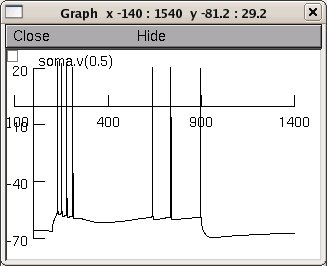
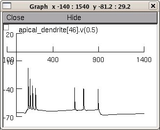
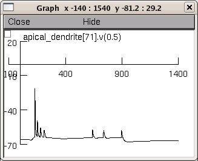

This is the readme for the model from the paper:
Markaki M, Orphanoudakis S, Poirazi P (2005) Modelling reduced excitability in aged CA1 neurons as a calcium-dependent process Neurocomputing 65-66:305-314

These model files were supplied by Dr Poirazi.

The model files were changed slightly after the paper however they reproduce the traces in Figure 3.

### Usage 
Auto-launch from ModelDB or download and extract the archive and then

#### unix/linux
Compile the mod files with "nrnivmodl mechanism" , then start with
```
nrngui mosinit.hoc
```

#### mswin
-----
Compile the mod files with `mknrndll`. Move the `nrnmech.dll` up one level to the top level directory. Double click on `mosinit.hoc` in a windows explorer.

Once the simulation has started press the run button to generate figures similar to the traces in Figure 2 (increased Ca2+):





20120201: `cadL.mod`, `cad.mod`, `cadN.mod` updated to `derivimplicit` as per http://www.neuron.yale.edu/phpBB/viewtopic.php?f=28&t=592
